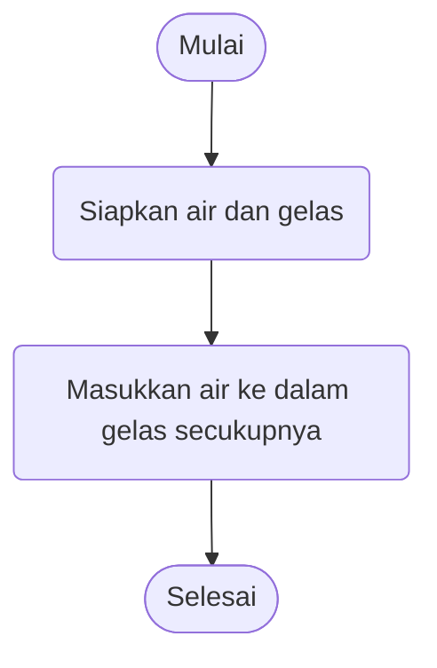

# Algoritma - Minitask
Membuat algoritma memindahkan air di dalam gelas

1. Mulai
2. Siapkan Air dan Gelas
3. Masukkan air ke dalam gelas secukupnya
4. Selesai

```mermaid
flowchart TD
    A([Mulai])
    B(Siapkan air dan gelas)
    C(Masukkan air ke dalam gelas secukupnya)
    D([Selesai])
    A --> B
    B --> C
    C --> D
```